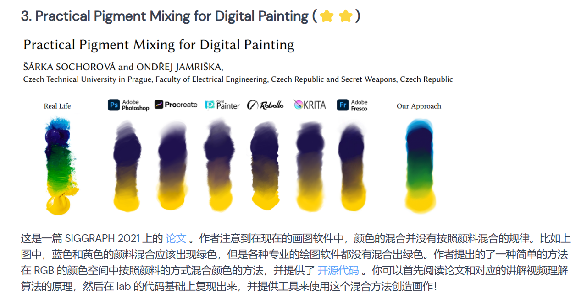
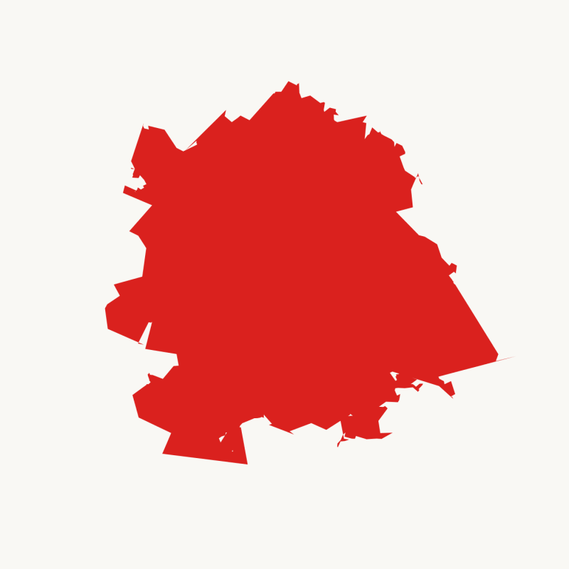
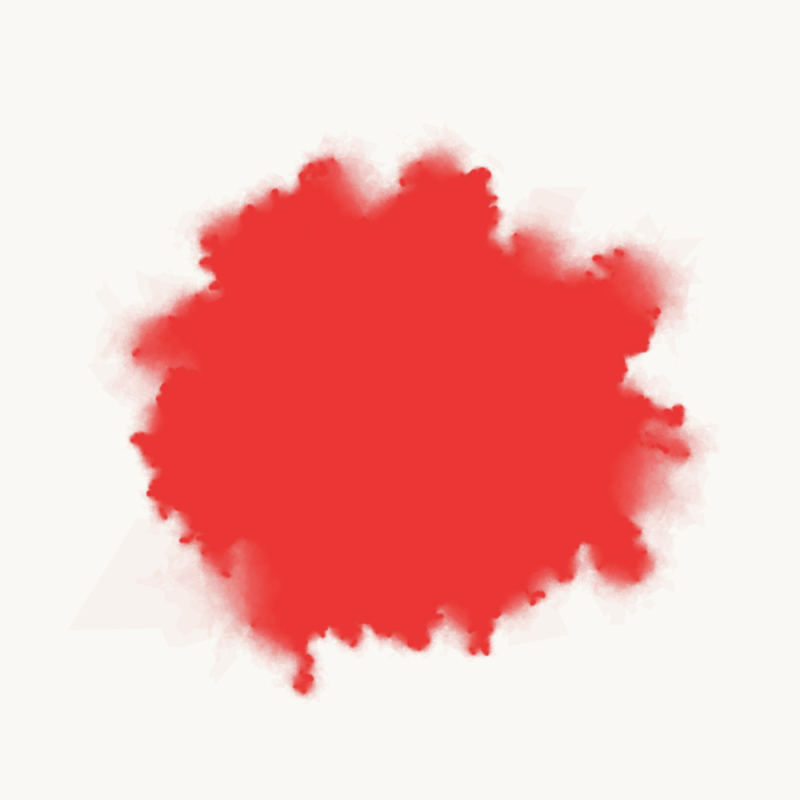
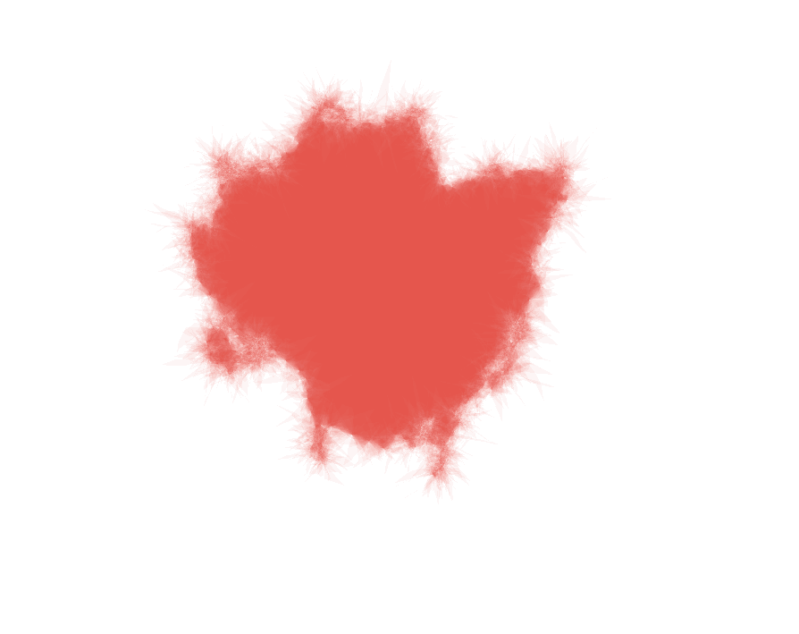
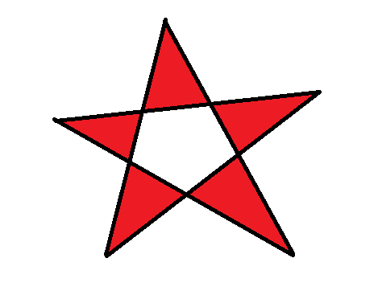
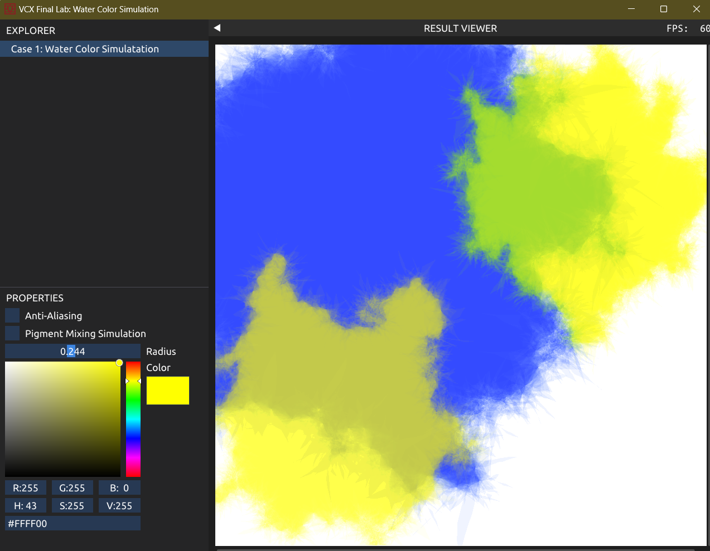
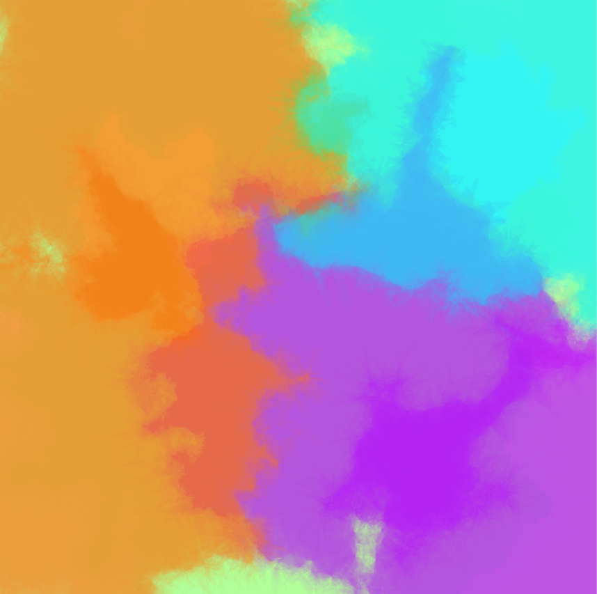
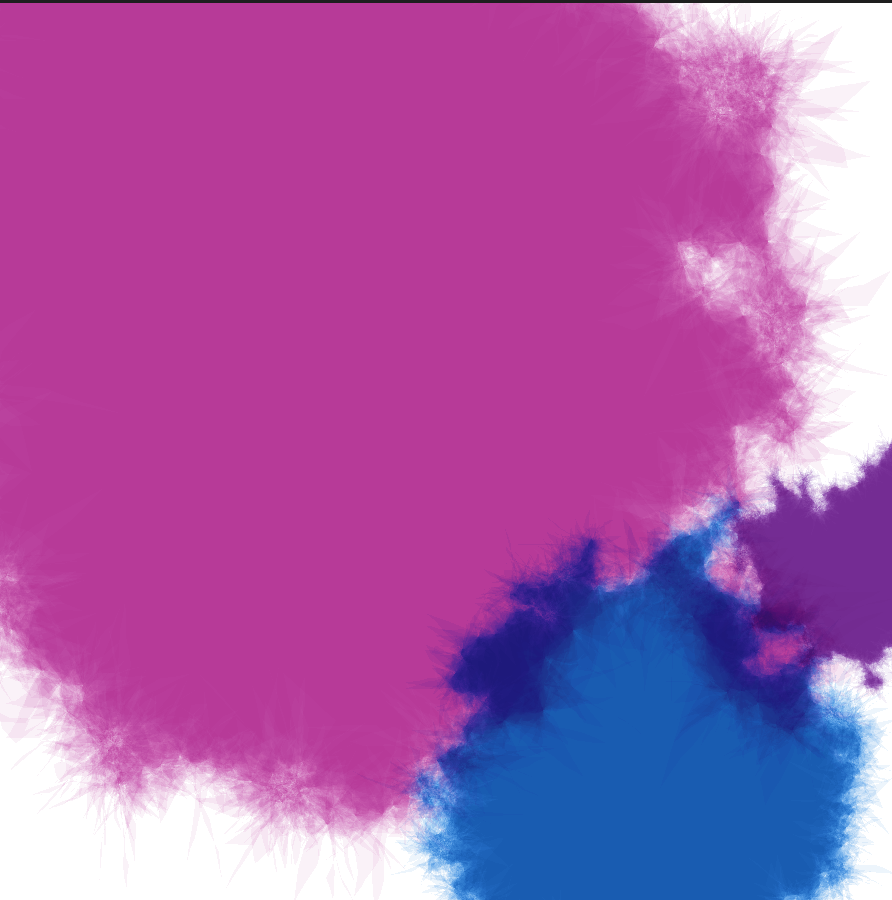
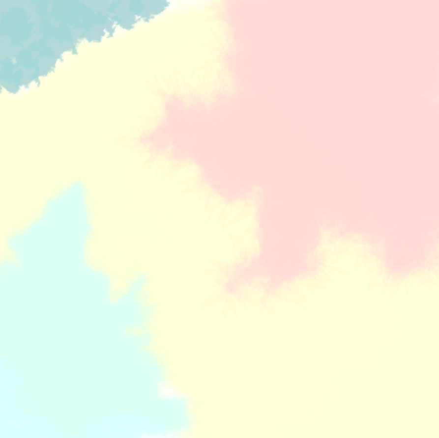

项目地址：

[https://gitee.com/anzhi-tinglan/water-color-simulation](https://gitee.com/anzhi-tinglan/water-color-simulation)

# 一、选题

在浏览期末实践项目的参考选题时，我对 Pigment Mixing 这一题目产生了浓厚的兴趣。

阅读了相关文献之后，在钦佩作者巧妙而不失严谨的思路之余，我也萌生了一个问题。各式各样的电子绘图软件中，无一不包含了各式各样的“画笔”，如水彩笔、铅笔、钢笔、油画笔等等等等。那么，这些画笔究竟是如何模拟现实生活中的多种多样的笔呢？如果可以实现一个水彩的画刷，再运用这篇论文提供的颜料混合的方法，就可以创造出真实的水墨晕染的效果了。

基于这一思考，我选定的题目是“水墨染料晕染效果的真实模拟”。

# 二、实现思路

通过查阅相关文献，我搜索到了许多有趣的算法，其中的一篇“用生成艺术模拟水彩画”的工作吸引了我。

[https://tylerxhobbs.com/essays/2017/a-generative-approach-to-simulating-watercolor-paints](https://tylerxhobbs.com/essays/2017/a-generative-approach-to-simulating-watercolor-paints)

## 1. 生成基础多边形

算法从一个规则的正多边形开始，通过迭代的方式生成一个基础多边形（base polygen），作为水墨染料晕染墨痕的基础形状。

正十边形

用正十边形生成的基础多边形

在一个迭代的过程中，对于当前多边形的每一条边，取该条边的中点记为 $ p $，对 $ p $ 做高斯扰动来改变一下 $ p $ 的位置，并将 $ p $ 加入到多边形的顶点集中。

在迭代的过程中，随着迭代的深度不断加深，我们需要相应的减小高斯扰动的方差，这是因为如果保持高斯扰动的方差不变，那么顶点改变的程度将不会减小，最终得到的多边形随机性过大，与原来的形状差距过大。

## 2. 堆叠透明层，形成墨痕

以 base polygen 的形状为基础，我们将生成 30 个图层，每个图层的透明度均为 $ 4\% $ 左右，最终堆叠形成最后的墨痕。

对于每一个图层 $ l $，都以在上一个步骤中生成的 base polygen 为基础，用更小的方差做类似的扰动，这样可以使得每一层的形状都具有随机性。

通过这样的方，可以使得在最终的墨痕中靠近中间的位置透明度最低，靠近边缘的位置透明度最高，真实的模拟了水彩颜料在画纸上晕染的效果。

原作者实现的效果，可以观察到在墨痕的左下角会有突兀的凸起。

笔者实现的效果，通过控制图层的方差，避免了突兀的凸起，生成的结果更具有真实性。

# 三、如何填充多边形？

在算法实现的过程中，给一个形状极不规则的多边形填充颜色是一个非常棘手的问题。通过上述算法生成的多边形，不仅有可能是凹多边形，甚至有可能出现如下图所示的情况：

一个极端的例子，在多边形的“内部”出现了不属于多边形的区域。

所以我们需要用一个良好的数据结构和算法来实现对于多边形的快速填充，即按顺序给定多边形的顶点，填充多边形内部的像素。

## 1. 数据结构——边表

对于多边形的每条边，定义**下点**为纵坐标更小的那个点，**上点**为纵坐标更大的那个点。

假设画布的大小为 $ (s,t) $。对于每一行建立一个可变长数组，即共建立 $ t $ 个 vector，命名为 $ e $。$ e[i] $ 中存放了**下点位于第** $ i $ **行的所有边**。

每条边记录如下信息：

 | 变量名 | x | dx | ymax | 
 | ---- | ---- | ---- | ---- | 
 | 含义 | 下点的横坐标 | 斜率的倒数。即当纵坐标移动一个单位时，横坐标应该移动的距离。 | 上点的纵坐标 | 

## 2. 算法——扫描线

从第 $ 0 $ 行开始，依次扫描画布的 $ t $ 行。

对于每 $ i $ 行。首先检查 $ e[i] $ 中是否有边的 ymax 等于 $ i $，如有，将其删除。

将 $ e[i] $ 中的所有边按照 x 值的大小排序，记排好序后的 x 值为 $ x_1,x_2,\dots, x_{2k} $。算法会保证 $ e[i] $ 中一定保存了**偶数条**边。依次填充第 $ i $ 行的

$$
[x_1,x_2],[x_3,x_4],\cdots,[x_{2k-1},x_{2k}]
$$
填充完毕后，将每条边的 x 加上 dx，存放到 $ e[i+1] $ 中。

事实上，当扫描到第 $ i $ 行时，$ e[i] $ 中保存的 x 值即为当前扫描线与多边形的全部交点，按照“奇进偶出”的原则进行填充，即可将属于多边形内部的点填充完毕。

# 四、颜色混合

在上述算法中，我们采用的颜色是 RGBA 制的颜色，即除了 RGB 颜色之外，还保存了该像素点的透明度信息。

在一般的颜色混合模式中，设画布上原来的颜色为 $ c_o $，现在要混合的颜色为 $ c $，透明度为 $ t $。则混合之后的颜色应为

$$
 c' = c \times t + c_o \times (1 - t) 
$$
正如论文中所述，这样的颜色混合模式不能实现在生活中真实颜料混合的效果。最为明显的，就是黄色和蓝色无法混合出绿色。

在程序的写作过程中，为了比较普通的颜色混合和论文中提供的颜色混合效果的差异，我设置了 pigment mixing 的勾选框。当用户勾选时，程序的颜色混合模式会切换为“颜料混合模式“。

右上角的黄色为开启“颜料混合模式”后混合的结果，而左下角的并未开启。很明显的可以看到，开启颜料混合模式后，蓝色和黄色混合出现了绿色。

# 五、作品展示

《Life》

《桑葚酒》

《简单爱》

